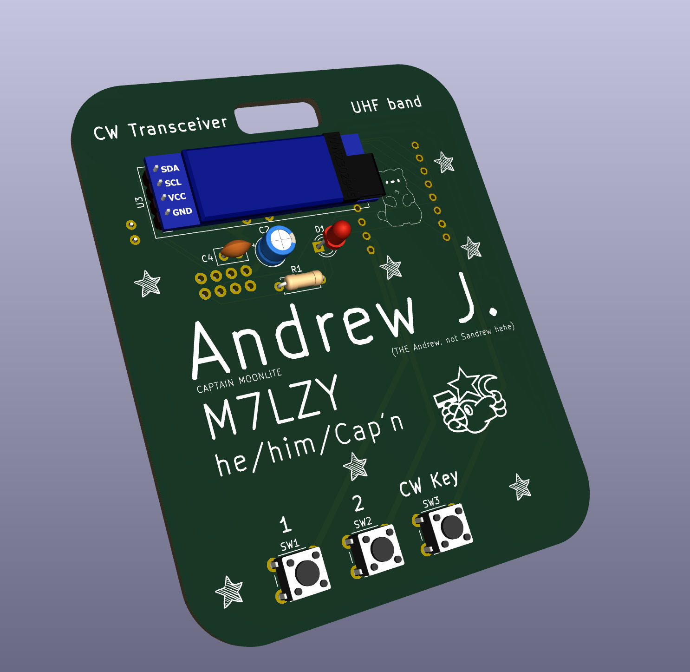
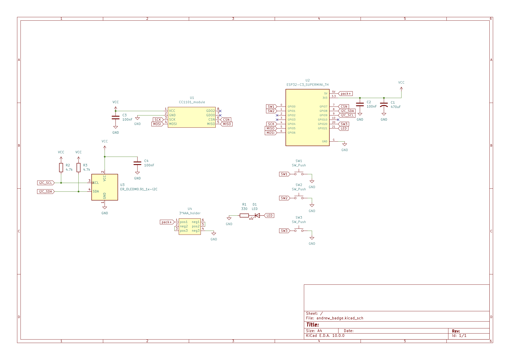
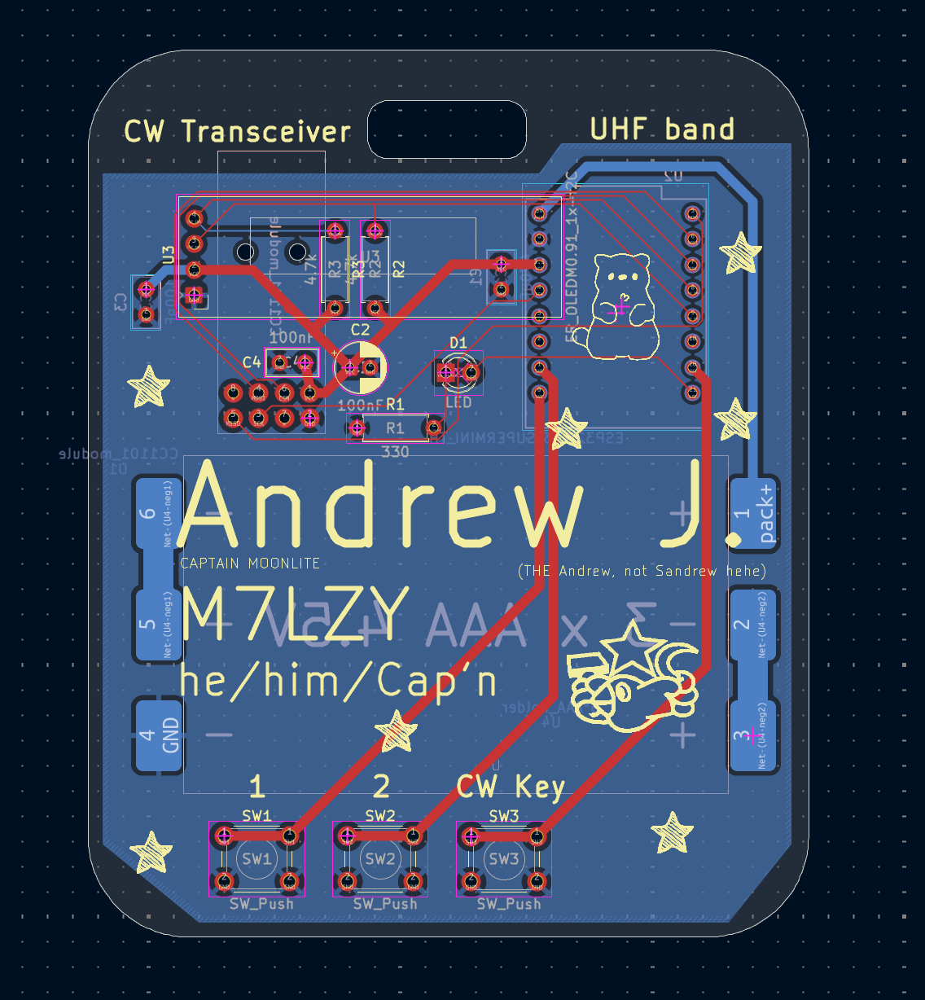

# Fallout Name Badge
UHF civilian CW transceiver using ESP32-C3 and radio module. Name tag for the real Andrew, not SanfrAndrew (he's larping)

PCB nametag built for Fallout

## Render

## Schematic

## PCB

